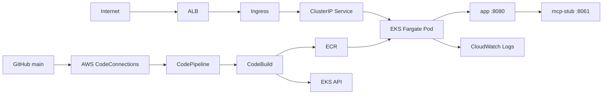

# POC — ALB → EKS Fargate → Express + sidecar (SSE)

POC para executar uma API Express + React e o sidecar `mcp-stub` no Amazon EKS
usando Fargate. O ALB recebe HTTP/HTTPS e encaminha para um `Service`
Kubernetes; a aplicação e o sidecar são containers do mesmo Pod, portanto o
sidecar continua privado e acessível em `127.0.0.1:8061`.

## Arquitetura



- `infra/terraform` é a fonte de infraestrutura: VPC, subnets privadas, NAT
  Gateway, EKS, Fargate profiles, IAM/IRSA, controller ALB, deployment,
  service, ingress, logs, ACM e Route 53 opcionais.
- O AWS Load Balancer Controller cria e mantém o ALB a partir do Ingress. O
  target type é `ip`, necessário para Pods EKS Fargate.
- Os Pods Fargate ficam em duas subnets privadas. O NAT Gateway permite pull
  do ECR, comunicação com APIs AWS e envio de logs.
- O controller e CoreDNS também possuem Fargate profiles dedicados. Não há
  node group EC2.
- O CodePipeline acompanha a branch `main` pelo AWS CodeConnections e chama
  CodeBuild para validar, publicar imagens no ECR e atualizar o Deployment.

## Pré-requisitos

- Docker com Compose v2
- Node.js 20+ (o POC usa Node 24 no CI)
- Terraform 1.5+, AWS CLI v2 e `kubectl`
- Credenciais AWS com permissão para provisionar os recursos
- Uma conexão GitHub disponível no AWS CodeConnections, na mesma região do
  pipeline
- Opcionalmente, uma hosted zone pública Route 53 para domínio + HTTPS

> Custo: EKS cobra pelo control plane, Fargate pelos Pods provisionados, além
> de ALB, NAT Gateway, ECR e CloudWatch Logs. O NAT é obrigatório nesta
> topologia porque Fargate não atribui IP público aos Pods. Destrua o POC ao
> terminar.

## Rodar localmente

```bash
make up
# http://localhost:8080

make test
make typecheck
```

## Primeiro deploy no EKS

1. Configure a infraestrutura:

```bash
cp infra/terraform/terraform.tfvars.example infra/terraform/terraform.tfvars
```

Mantenha `enable_custom_domain = false` para testar pelo DNS HTTP do ALB. Para
HTTPS, preencha `hosted_zone_id`, `domain_name` e `subdomain`.

2. Crie o ECR, publique imagens com tag imutável e aplique o Terraform:

```bash
IMAGE_TAG="$(git rev-parse --short HEAD)"

make tf-init
make ecr
make ecr-login
make push IMAGE_TAG="$IMAGE_TAG"
make apply IMAGE_TAG="$IMAGE_TAG"
```

O `apply` instala o AWS Load Balancer Controller, cria o Deployment de dois
containers, espera o rollout e aguarda o ALB do Ingress. A máquina que executa
o Terraform precisa do AWS CLI, pois os providers Helm/Kubernetes obtêm o token
de autenticação do cluster por `aws eks get-token`.

3. Valide o ambiente:

```bash
make k8s-status
APP_URL="$(terraform -chdir=infra/terraform output -raw app_url)"

curl -s "$APP_URL/api/health" | jq
curl -s "$APP_URL/api/sync" | jq
curl -s "$APP_URL/api/sidecar-status" | jq
curl -N "$APP_URL/api/stream"
```

O último comando deve receber um evento SSE por segundo e terminar com `done`.

## Atualização e rollback local

O CodePipeline faz as atualizações regulares. Estes comandos continuam úteis
para depuração ou rollback manual, com uma tag ECR conhecida:

```bash
IMAGE_TAG="$(git rev-parse --short HEAD)"
make push IMAGE_TAG="$IMAGE_TAG"
make deploy IMAGE_TAG="$IMAGE_TAG"
```

Para rollback, informe uma tag ECR conhecida:

```bash
make deploy IMAGE_TAG="<tag-anterior>"
```

Use `make k8s-logs` para acompanhar o container `app`. Os logs de ambos os
containers também vão para o log group retornado por
`terraform output -raw cloudwatch_log_group`.

## CI/CD

O Terraform cria o bucket de artefatos com versionamento, criptografia e acesso
controlado pelas roles do pipeline, além das roles de serviço, CodeBuild e
CodePipeline. A conexão GitHub é criada e autorizada fora do Terraform porque
a instalação do GitHub exige interação no console AWS; ela é apenas
referenciada pela variável `codeconnections_connection_arn`.

O fluxo é:

1. Um push em `main` — inclusive após um merge — chega ao CodePipeline pela
   conexão GitHub.
2. CodeBuild executa `poc/buildspec.yml`: instala dependências, roda
   typecheck/test/build, cria as imagens e publica `latest` e a tag imutável
   com o commit SHA.
3. O mesmo build atualiza o Deployment EKS e espera o rollout por até cinco
   minutos.

Antes do primeiro `apply`, ajuste no `terraform.tfvars`:

```hcl
github_repository              = "owner/repository"
github_branch                  = "main"
codeconnections_connection_arn = "arn:aws:codeconnections:us-east-1:<account-id>:connection/<connection-id>"
```

Após o primeiro `apply`, inicie a primeira execução com o snapshot atual de
`main` caso o pipeline não tenha sido disparado por um novo push:

```bash
aws codepipeline start-pipeline-execution \
  --name "$(terraform -chdir=infra/terraform output -raw codepipeline_name)"
```

Não são necessários secrets AWS nem permissões OIDC no GitHub para deploy. A
role do CodeBuild tem acesso mínimo ao ECR, `eks:DescribeCluster`, ao bucket
de artefatos e permissão Kubernetes de edição apenas no namespace da aplicação.
Os logs do processo ficam no output `codebuild_log_group`.

## Migração de um ambiente ECS existente

A migração não preserva os recursos de execução: task definition, service,
roles de task, ALB e target group ECS deixam de existir. ECR, ACM e a hosted
zone são reaproveitados quando presentes.

Antes de aplicar esta versão em um state que ainda controla ECS:

```bash
terraform -chdir=infra/terraform state pull > terraform-state-before-eks.json
make tf-plan IMAGE_TAG="<tag-ja-publicada>"
```

Revise o plano cuidadosamente. Ele terá destruição dos recursos ECS/ALB
legados e criação do EKS, NAT e ALB gerenciado pelo controller; haverá janela
de indisponibilidade. Faça a publicação das imagens antes do `apply`, valide
os endpoints acima e só então remova qualquer DNS/integração externa residual.

## Limpeza

```bash
make destroy
```

Confirme a remoção do EKS, Fargate profiles, ALB do controller, NAT Gateway,
ECR e log groups para evitar cobranças residuais.
